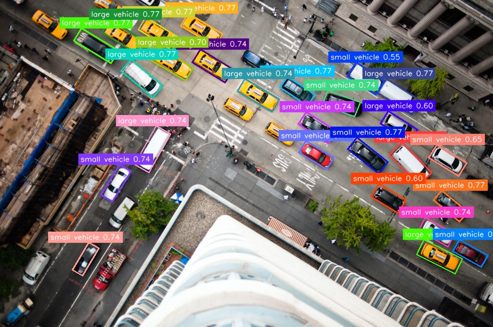

# YOLOv8-obb Example

## Overview

Object detection with oriented bounding boxes introduces an angle the bounding box
sits on to more accurately locate the identified object.

The model in this example has been trained on the 
[DOTAv1 dataset](https://captain-whu.github.io/DOTA/index.html) 
which is designed for detecting objects found in aerial photography.


## Usage

Make sure you have downloaded the data files first for the examples.
You only need to do this once for all examples.

```
cd example/
git clone https://github.com/swdee/go-rknnlite-data.git data
```

Run the YOLOv8-obb example.
```
cd example/yolov8-obb
go run yolov8-obb.go
```

This will result in the output of:
```
Driver Version: 0.8.2, API Version: 1.6.0 (9a7b5d24c@2023-12-13T17:31:11)
Model Input Number: 1, Ouput Number: 4
Input tensors:
  index=0, name=images, n_dims=4, dims=[1, 640, 640, 3], n_elems=1228800, size=1228800, fmt=NHWC, type=INT8, qnt_type=AFFINE, zp=-128, scale=0.003922
Output tensors:
  index=0, name=/model.22/Concat_1_output_0, n_dims=4, dims=[1, 79, 80, 80], n_elems=505600, size=505600, fmt=NCHW, type=INT8, qnt_type=AFFINE, zp=65, scale=0.209463
  index=1, name=/model.22/Concat_2_output_0, n_dims=4, dims=[1, 79, 40, 40], n_elems=126400, size=126400, fmt=NCHW, type=INT8, qnt_type=AFFINE, zp=68, scale=0.202605
  index=2, name=/model.22/Concat_3_output_0, n_dims=4, dims=[1, 79, 20, 20], n_elems=31600, size=31600, fmt=NCHW, type=INT8, qnt_type=AFFINE, zp=42, scale=0.142794
  index=3, name=/model.22/Sigmoid_output_0, n_dims=3, dims=[1, 1, 8400, 0], n_elems=8400, size=8400, fmt=UNDEFINED, type=INT8, qnt_type=AFFINE, zp=-128, scale=0.002982
large vehicle @ (809 322 88 37 angle=0.797911) 0.834911
small vehicle @ (901 415 71 27 angle=0.704224) 0.771293
large vehicle @ (377 47 84 31 angle=0.544957) 0.771293
large vehicle @ (289 55 83 31 angle=0.544957) 0.771293
large vehicle @ (155 80 90 31 angle=0.554325) 0.771293
large vehicle @ (213 63 96 32 angle=0.554325) 0.771293
large vehicle @ (252 147 86 32 angle=0.694856) 0.771293
small vehicle @ (584 175 68 28 angle=0.591800) 0.771293
large vehicle @ (787 184 84 35 angle=0.573063) 0.771293
small vehicle @ (623 308 69 29 angle=0.554325) 0.771293
small vehicle @ (723 308 83 31 angle=0.666750) 0.771293
small vehicle @ (227 343 28 75 angle=0.554325) 0.740259
large vehicle @ (402 121 81 32 angle=0.544957) 0.740259
large vehicle @ (300 264 35 93 angle=0.516851) 0.740259
small vehicle @ (872 467 70 30 angle=0.507482) 0.740259
small vehicle @ (166 505 24 66 angle=0.535588) 0.740259
large vehicle @ (495 183 85 31 angle=0.544957) 0.740259
small vehicle @ (673 199 73 32 angle=0.366951) 0.740259
small vehicle @ (622 250 74 30 angle=0.573063) 0.740259
large vehicle @ (317 117 82 32 angle=0.535588) 0.698013
small vehicle @ (894 317 72 32 angle=0.554325) 0.652124
large vehicle @ (868 516 90 34 angle=0.460638) 0.652124
small vehicle @ (774 396 66 32 angle=0.544957) 0.603226
large vehicle @ (793 248 72 30 angle=0.573063) 0.599939
small vehicle @ (725 146 71 34 angle=0.563694) 0.552175
small vehicle @ (943 512 68 29 angle=0.516851) 0.500000
Model first run speed: inference=29.918049ms, post processing=7.956524ms, rendering=3.191652ms, total time=41.066225ms
Saved object detection result to ../data/intersection-out.jpg
Benchmark time=582.914292ms, count=20, average total time=29.145714ms
done
```

The returned coordinates for each object `small vehicle @ (774 396 66 32 angle=0.544957) 0.603226` are 
in the format of a box of `(X, Y, Width, Height)` and an angle in Radians that this box gets rotated.

The saved JPG image with oriented bounding boxes.




See the help for command line parameters.
```
$ go run yolov8-obb.go --help

Usage of /tmp/go-build3751821681/b001/exe/yolov8-obb:
  -i string
        Image file to run object detection on (default "../data/intersection.jpg")
  -l string
        Text file containing model labels (default "../data/yolov8_obb_labels_list.txt")
  -m string
        RKNN compiled YOLO model file (default "../data/yolov8n-obb-640-640-rk3588.rknn")
  -o string
        The output JPG file with pose detection markers (default "../data/intersection-out.jpg")
```


## Background

This YOLOv8-obb example is a Go conversion of the [C API example](https://github.com/airockchip/rknn_model_zoo/blob/main/examples/yolov8_obb/cpp/main.cc).

